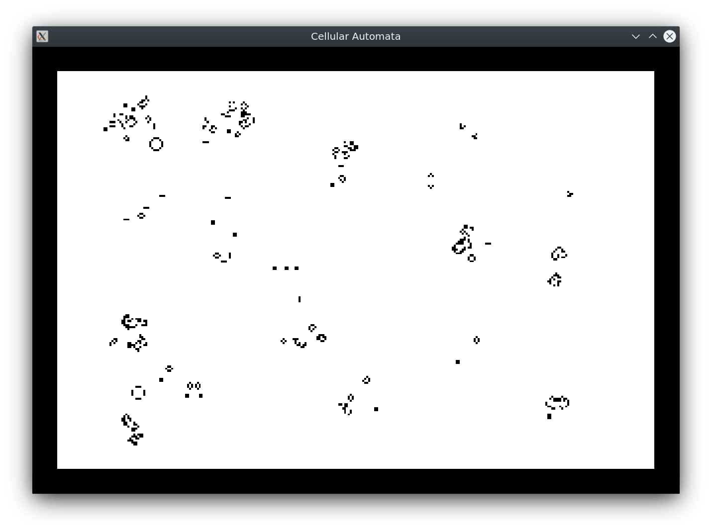

# RUST - Cellular Automata

> I'm a rust noob and i'm doing this kind of project to learn.

Basic conway's game of life rust implementation.

To launch:
```
cargo run
```

- Press `space` to pause/unpause.
- Press `mouse left` to spawn a cell.
- Press `mouse right` to kill a cell.

<h1 align="center">
	<br>
	
	<br>
</h1>
